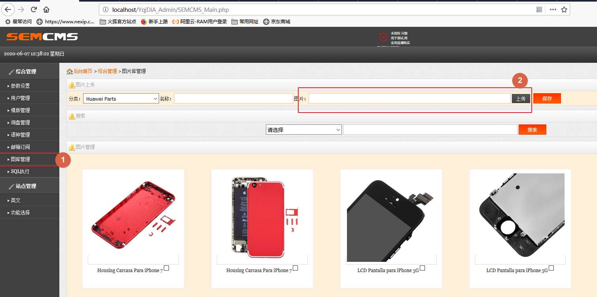
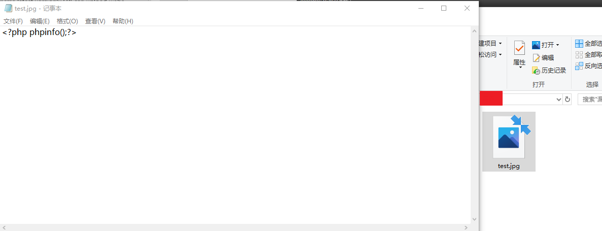
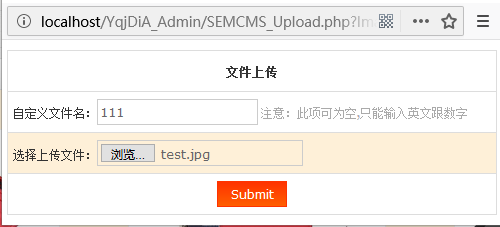
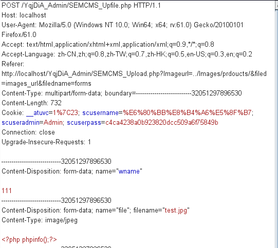
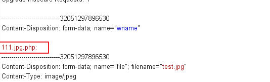
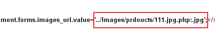
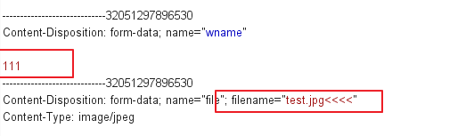
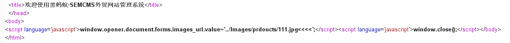
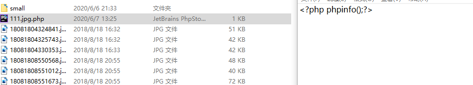
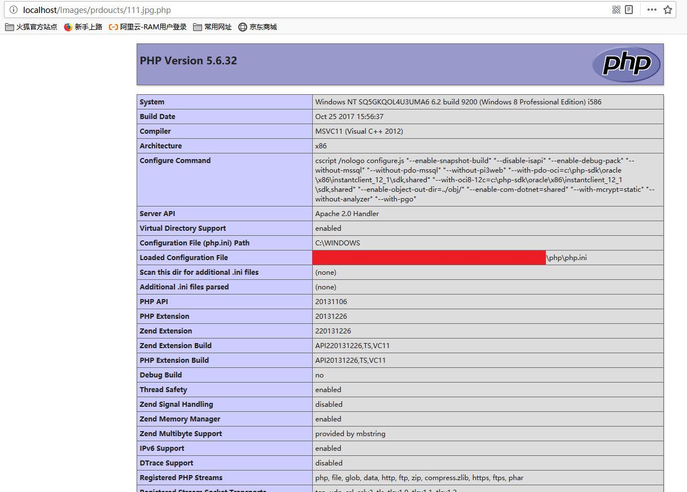

# Semcms latest version(v3.9) allow Arbitrary file upload when it runs on a windows server whose hard drive patition is NTFS.
## 1. We should log in to the Web Administrator Console.

## 2. Attempt to upload a webshell in PHP format.

###Choose a jpg webshell, whose content is "&lt?php phpinfo();?&gt"

### Afterward, click the "Submit" button, and then interupt and observe the HTTP request in Burp Suite.

### Manually change the “wname” param to “111.jpg.php:” in Burp Suite(see picture below).

## And the response will show the path & filename(../Images/projoucts/111.jpg.php:.jpg) you just uploaded.

## However, due to the characteristics of NTFS, the actual file will appear as a 0kb-sized "111.jpg.php," rather than the "111.jpg.php:.jpg" shown in response.

 
## 3. (Key point) Rewrite content to the zero-KB webshell

### Place the HTTP data packet from the recent "Submit" click into Burp's Repeater, preparing to make modifications before resending it once again.

### Manually modify it as follow.

### And then click “Forward” in Burpsuite, the response shows we have created file 111.jpg<<<< successfully.

### However, upon checking from the file explorer, there is no file named "111.jpg<<<<". Instead, the previously created "111.jpg.php" file has been overwritten and now contains new content.

### By accessing the webshell file from the URL http://localhost/Images/prdoucts/111.jpg.php, the malicious code is executed.

